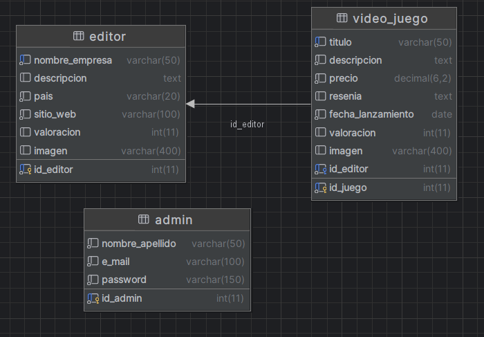

## Integrantes
* **Francisco Benavidez** - javierosmartorres@gmail.com
* **Mauro Ordoñez** - mordoniez@alumnos.exa.unicen.edu.ar

---

## Temática del Proyecto
**Videojuegos**

### Descripción
Se trata de un sito web que muestra información sobre videojuegos de Steam. Semejante a https://steamdb.info/

---

## Diagrama de Entidad Relación (DER)
A continuación se presenta la estructura de la base de datos diseñada para este proyecto:

# Importante 
### Usuario administrador

Para acceder al panel de administración se debera ingresar a travez de una URL
ya que la vita pública no cuenta con un botón para acceder al formulario de login
entendiendo que el usuario publico es ajeno al panel de administración por lo que
no se le da intreracción con el login, quedando solo a conocimiento de los administradores.

**URL:** (BASE_URL)/administrar

**usuario:** webadmin@mail.com

**contraseña:** admin
